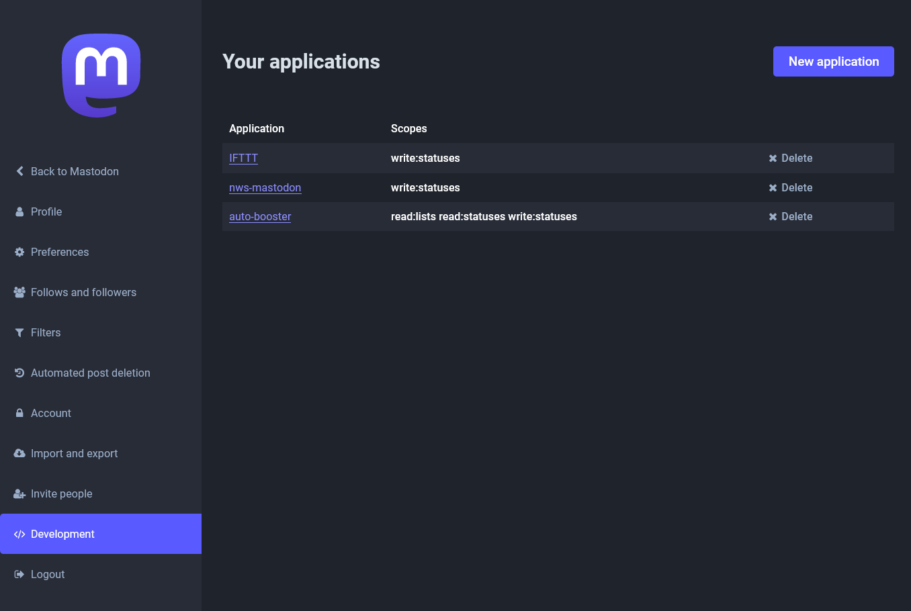

# nws-mastodon

1. Git clone
2. Change the variables in example.env
   - AUTH_TOKEN: Taken from your account development preferences.
     
   - DOMAIN_NAME: The instance domain where your account is registered (e.g. mastodon.social).
   - NWS_ALERT_ZONE: Find your county [here](https://alerts.weather.gov#html_state_county).
   - NWS_API_USER_AGENT: A self-determined string to identify yourself with to the [NWS API](https://www.weather.gov/documentation/services-web-api).
   - HEADER: Whatever you want displayed above the alert.
   - FOOTER: Whatever you want displayed below the alert.
3. Run with [Docker](https://docs.docker.com/engine/install/) using `docker compose up -d`
